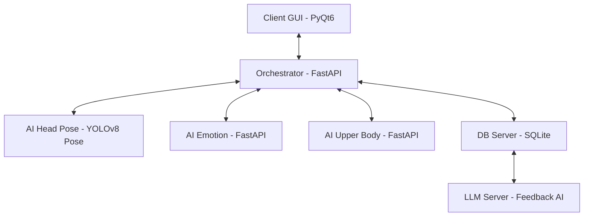

# Focus Monitor (업무 집중도 모니터링 시스템)

딥러닝 기반의 실시간 업무 집중 모니터링 및 코칭 시스템입니다. 웹캠을 통해 사용자의 상태(고개 각도, 표정, 자세)를 분석하여 집중 상태를 판정하고, 모니터링 종료 후 AI 피드백을 제공합니다.

---

## 🏗 시스템 아키텍처

본 프로젝트는 확장성과 효율성을 위해 **Microservices Architecture (MSA)** 스타일의 구조를 채택하고 있습니다.



1.  **Client (PyQt6)**: 실시간 웹캠 프리뷰, 주기적 이미지 캡처 및 전송, 비집중 알림 시각화.
2.  **Orchestrator (FastAPI)**: 요청 분배, 다중 모델 결과 집계(Aggregation), 최종 비집중 판정 알고리즘 수행.
3.  **AI Head (YOLOv8 Pose)**: YOLOv8 Pose 모델을 이용한 실시간 고개 각도 추정 및 사용자 추적(Tracking).
4.  **Feedback AI**: 세션 데이터 기반 맞춤형 코멘트 생성 (Ollama/Llama 3.1).

---

## 📌 주요 기능

*   **실시간 집중도 모니터링**: 3초 주기로 사용자의 상태를 분석하여 집중 여부 판정.
*   **고도화된 Head Pose 분석 (YOLOv8)**:
    *   **Pitch, Yaw, Roll 추정**: 안면 키포인트를 활용한 정밀한 각도 계산.
    *   **타겟 잠금 및 추적 (Target Locking)**: 여러 사람이 포착되어도 모니터링 대상을 고정하여 지속적으로 추적.
    *   **이탈/산만함 감지**: 고개 숙임, 옆보기 등 설정된 임계값을 벗어난 동작 실시간 감지.
*   **즉각적인 피드백**: 비집중 상태 감지 시 화면 오버레이를 통해 주의 환기 유도.
*   **보안 강화**: API Key 인증 및 요청 데이터 크기 제한을 통한 안정적인 서버 운영.

---

## 📂 프로젝트 구조 (uv Workspace)

```text
deeplearning-repo-2/
├── apps/
│   ├── client/           # [UI] PyQt6 데스크탑 애플리케이션
│   ├── orchestrator/     # [Control] 중앙 제어 서버
│   ├── ai_head/          # [Vision] YOLOv8 기반 Head Pose 분석 서버
│   ├── ai_emotion/       # [Vision] 표정 분석 서버 (오픈 소스 예정)
│   ├── ai_body/          # [Vision] 상체 자세 분석 서버 (오픈 소스 예정)
│   ├── db_server/        # [Data] SQLite 데이터 관리 서버
│   └── llm_server/       # [AI] 피드백 생성 서버
├── packages/
│   └── shared/           # [Common] 공통 스키마 및 유틸리티
├── pyproject.toml        # uv 워크스페이스 설정
└── README.md
```

---

## 🛠 기술 스택

*   **Language**: Python 3.10+
*   **Environment**: `uv` (Fast Python package manager)
*   **GUI**: PyQt6, OpenCV
*   **Backend**: FastAPI, Uvicorn, HTTPX (Async communication)
*   **AI/Vision**: **YOLOv8 Pose**, Ultralytics, NumPy, Pydantic
*   **Security**: API Key Header Auth, Request Size Limit Middleware

---

## 📋 설치 및 실행 방법

### 1. 필수 요구사항
*   Python 3.10 이상
*   `uv` 설치: `pip install uv`

### 2. 프로젝트 초기화
```bash
# 의존성 설치 및 가상환경 구축
uv sync
```

### 3. 서버 실행 (각각의 터미널에서 실행)

**1) AI Head 서버 (Port 8001)**
```bash
cd apps/ai_head
uv run python src/ai_head/main.py
```

**2) 오케스트레이션 서버 (Port 8000)**
```bash
cd apps/orchestrator
uv run python src/orchestrator/main.py
```

**3) 클라이언트 프로그램**
```bash
cd apps/client
uv run python src/client/main.py
```

---

## 🔒 보안 및 환경 설정
*   **API 인증**: 모든 서버 간 통신은 `X-API-Key` 헤더 인증을 거칩니다.
*   **환경 변수**: 각 앱의 `.env` 파일에 `API_KEY`가 반드시 설정되어 있어야 합니다.
*   **데이터 제한**: 서버 안정성을 위해 10MB 이상의 이미지 데이터 전송은 차단됩니다.

---

## 👥 팀 정보
*   **딥러닝 프로젝트 2조**

---
© 2026 Focus Monitor Project
