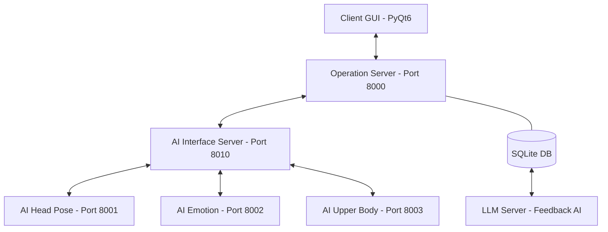

# Focus Monitor (업무 집중도 모니터링 시스템)

딥러닝 기반의 실시간 업무 집중 모니터링 및 코칭 시스템입니다. 본 프로젝트는 **비즈니스 로직(Operation)**과 **AI 오케스트레이션(Interface)** 레이어를 완전히 분리하고, **데이터베이스를 운영 서버에 통합**한 견고한 MSA(Microservices Architecture) 구조를 갖추고 있습니다.

---

## 🚀 시작하기 (Quick Start)

프로젝트를 클론한 후, 다음 단계에 따라 즉시 실행할 수 있습니다.

### 1. 선수 요구 사항
- **Python 3.10+**
- **[uv](https://docs.astral.sh/uv/getting-started/installation/) 패키지 매니저** (설치 권장)

### 2. 프로젝트 설정 및 실행

```bash
# 1. 의존성 설치 (루트 폴더에서 한 번만 실행)
uv sync

# 2. 필수 모델 파일 배치
# - apps/ai_emotion/best.pt 파일을 해당 폴더에 넣어주세요.
# - (나머지 모델은 실행 시 자동 다운로드됩니다.)

# 3. 통합 실행 스크립트 가동
./run_dev.sh  # (Windows의 경우 run_dev.bat)
```

이후 `dev.py` 스크립트가 자동으로 각 서버의 `.env` 파일을 생성하고 보안 키를 검사하며 서버를 구동합니다.

---

## 🏗 시스템 아키텍처

비즈니스 운영 레이어와 AI 기술 레이어의 분리를 통해 시스템의 독립성과 확장성을 극대화했습니다.



### 🔹 레이어별 역할
1.  **Client (PyQt6)**: 
    *   사용자 인터페이스 제공 및 3초 주기 웹캠 이미지 캡처.
    *   **Operation Server**로 분석 요청 전송 및 결과 시각화.
    *   **최종 리포트 창**: 세션 종료 시 집중 비율, 비집중 횟수, 학습 시간 요약 출력.
2.  **Operation Server (FastAPI)**: 
    *   시스템의 단일 진입점(Gateway) 및 세션 관리자.
    *   **세션 기반 데이터 관리**: `monitoring_sessions`(요약)와 `focus_logs`(로그) 테이블 분리 설계.
    *   보안 인증(API Key), 사용량 제한(Rate Limit) 관리.
3.  **AI Interface Server (FastAPI)**: 
    *   AI 오케스트레이터.
    *   여러 AI 모델 서버의 결과를 취합하여 최종 '비집중' 여부 판정 로직 수행.
4.  **AI Models**: 
    *   **AI Head**: YOLOv8 Pose 기반 고개 각도(Pitch, Yaw, Roll) 및 타겟 추적 분석.

---

## 📌 주요 기능

*   **실시간 대시보드**: 현대적인 다크 테마 UI, 집중도 점수 및 변화 그래프 실시간 출력.
*   **세션 기반 리포트**: 모니터링 종료 후 **최종 집중 비율, 비집중 원인 통계, 학습 시간** 등을 요약한 전문 리포트 화면 제공.
*   **정밀한 상태 감지**: YOLOv8 Pose를 활용한 타겟 고정 추적 및 이탈 동작 감지.
*   **즉각적인 알림**: 비집중 감지 시 **알림음(Beep)** 및 **화면 오버레이** 팝업.
*   **이중화 데이터 저장**: 실시간 로그(Raw Data)와 세션별 요약 데이터(Summary)를 분리 저장하여 조회 효율성 극대화.
*   **지능형 연결 대기**: 서버 연결이 완료될 때까지 세션 시작 버튼 자동 제어.

---

## 📂 프로젝트 구조 (uv Workspace)

본 프로젝트는 **uv Workspace**를 사용하여 여러 마이크로서비스를 효율적으로 관리합니다.

### 🔹 의존성 관리 및 패키지 추가
각 서비스는 독립적인 `pyproject.toml`을 가지며, 특정 서비스에 패키지를 추가하려면 해당 폴더로 이동하여 명령어를 실행합니다.

```bash
# 특정 앱에 패키지 추가 예시
cd apps/ai_head
uv add <package_name>
```

*   **자동 동기화**: `run_dev.sh`는 내부적으로 `uv run`을 사용합니다. 패키지 변경 후 별도의 설치 과정 없이 스크립트를 재실행하는 것만으로도 **자동으로 의존성이 동기화**됩니다.
*   **공유 환경**: 모든 서비스는 루트의 `.venv` 가상환경을 공유하여 효율적으로 관리됩니다.
*   **파이썬 버전 관리**: 각 서비스는 `pyproject.toml`의 `requires-python`을 통해 필요한 파이썬 버전을 개별적으로 명시할 수 있습니다. `uv`는 워크스페이스 내 모든 서비스의 요구사항을 만족하는 최적의 파이썬 버전을 자동으로 선택하여 관리합니다.

### 🔹 디렉토리 구조
```text
deeplearning-repo-2/
├── apps/
│   ├── client/           # [UI] 사용자용 데스크탑 어플리케이션
│   ├── operation_server/ # [Core] 비즈니스 로직 및 SQLite DB 통합 (Port 8000)
│   ├── ai_interface/     # [AI Core] 여러 AI 모델 결과를 집계하는 서버 (Port 8010)
│   ├── ai_head/          # [Vision] YOLOv8 기반 Head Pose 분석 서버 (Port 8001)
│   ├── ai_emotion/       # [Vision] 감정 분석 서버 (Port 8002)
│   └── llm_server/       # [AI] Ollama 기반 피드백 생성 서버 (Port 8004)
├── packages/
│   └── shared/           # [Common] 프로젝트 공통 데이터 규격 (Pydantic)
├── scripts/              # [Dev] 개발용 유틸리티 스크립트
├── run_dev.sh            # 통합 서버 실행 스크립트 (Windows: run_dev.bat)
├── stop_dev.sh           # 서버 일괄 종료 스크립트 (Windows: stop_dev.bat)
├── pyproject.toml        # 프로젝트 전체 워크스페이스 설정
└── README.md             # 프로젝트 가이드
```

---

## 📋 실행 및 테스트 방법

모든 서버는 루트 디렉토리에서 `uv sync`를 완료한 후 실행해야 합니다.  
슬랙에서 `best.pt`를 `deeplearning-repo-2/apps/ai_emotion/best.pt` 위치에 다운받은 후 실행해야 합니다.

### 1. 통합 실행 (권장)

개발 편의를 위해 백엔드 서버와 클라이언트 프로그램을 한 번에 실행하고 관리할 수 있는 스크립트를 제공합니다. 이 스크립트는 **포트 충돌 확인, .env 파일 자동 생성, 통합 로그 출력** 기능을 지원하며 Windows, macOS, Linux를 모두 지원합니다.

#### 🍎 macOS / 🐧 Linux
```bash
# 모든 서버 및 클라이언트 일괄 실행
./run_dev.sh

# 종료 (실행 중인 터미널에서 Ctrl+C 또는 별도 터미널에서 실행)
./stop_dev.sh
```

#### 🪟 Windows
```cmd
# 모든 서버 및 클라이언트 일괄 실행
run_dev.bat

# 종료 (실행 중인 터미널에서 Ctrl+C 또는 별도 터미널에서 실행)
stop_dev.bat
```

### 2. 개별 서비스 실행 (수동)

특정 서버만 별도로 실행하거나 디버깅이 필요한 경우 각 디렉토리에서 수동으로 실행할 수 있습니다.

**1) AI Head 서버** (Port 8001)
```bash
cd apps/ai_head && uv run python src/ai_head/main.py
```

**2) AI Emotion 서버** (Port 8002)
```bash
cd apps/ai_emotion && uv run python src/ai_emotion/main.py
```

**3) AI Interface 서버** (Port 8010)
```bash
cd apps/ai_interface && uv run python src/ai_interface/main.py
```

**4) Operation 서버** (Port 8000)
```bash
cd apps/operation_server && uv run python src/operation_server/main.py
```

**5) LLM 서버** (Port 8004)
```bash
cd apps/llm_server && uv run python src/llm_server/main.py
```

### 3. 클라이언트 프로그램 실행 (수동 실행 시)

백엔드 서버를 수동으로 각각 실행한 경우, 별도의 터미널에서 클라이언트를 실행합니다. (`./run_dev.sh`를 사용했다면 이 단계는 건너뜁니다.)

```bash
cd apps/client
uv run python src/client/main.py
```

---

## 🔒 보안 및 데이터 관리
*   **X-API-Key**: 모든 통신은 HTTP 헤더의 API Key 인증을 통해 보호됩니다. 
*   **환경 변수**: 각 서비스 폴더의 `.env` 파일에 동일한 `API_KEY` 설정이 필수입니다.
*   **SQLite DB**: 운영 서버 실행 시 `apps/operation_server/focus_monitor.db` 경로에 데이터베이스가 자동으로 생성됩니다.

---

## 👥 팀 정보
*   **딥러닝 프로젝트 2조**

---
© 2026 Focus Monitor Project
